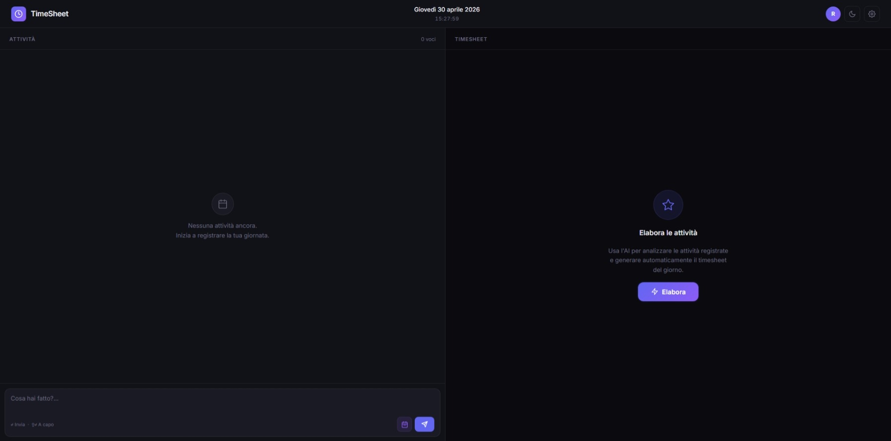
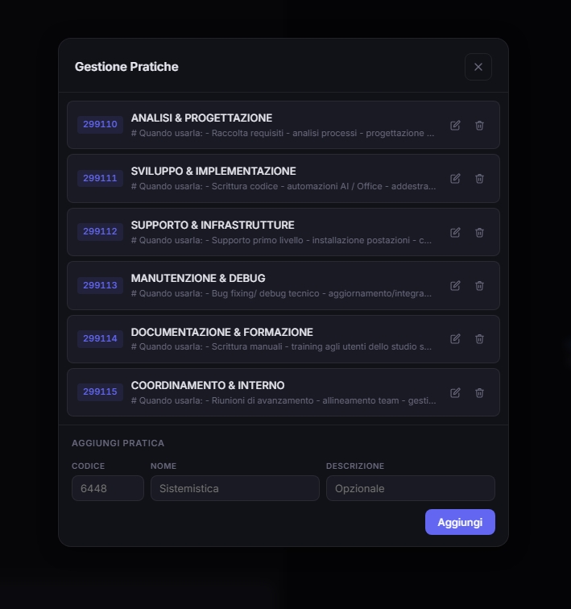

# TimeSheet App

Applicazione desktop locale per trasformare note scritte al volo in un timesheet ordinato, professionale e gia' associato al numero di pratica corretto.

L'idea e' semplice: durante la giornata puoi scrivere attivita' in testo libero, anche in modo informale. L'app le raccoglie, importa anche eventuali riunioni da Outlook, e usa OpenAI per generare automaticamente un timesheet strutturato. Di default l'elaborazione porta sempre il totale a `8.00` ore, distribuendo il tempo in modo coerente rispetto alle attivita' inserite e alle durate note delle riunioni.


## Screenshot

### Applicazione completa



### Gestione pratiche



## Cosa fa

- Registra attivita' giornaliere in testo libero, senza obbligarti a compilare subito un timesheet formale.
- Importa le riunioni di Outlook e usa la loro durata reale come riferimento in fase di elaborazione.
- Classifica automaticamente le attivita' in base ai numeri pratica disponibili.
- Trasforma appunti disordinati in descrizioni professionali, pronte da copiare in un gestionale o in altri sistemi.
- Bilancia il risultato finale a `8.00` ore totali.
- Permette di gestire le pratiche direttamente dall'interfaccia, con codice, nome e descrizione utile per l'AI.
- Consente di rivedere il risultato finale prima di copiarlo o inviarlo altrove.

## Come funziona

1. Durante la giornata aggiungi attivita' con testo libero, ad esempio note veloci, ticket, supporti, sviluppi o appunti scritti "alla buona".
2. Se vuoi, importi anche le riunioni del giorno da Outlook.
3. L'app invia le attivita' a OpenAI insieme all'elenco delle pratiche disponibili.
4. Il modello raggruppa le attivita' simili, scrive descrizioni piu' pulite e assegna a ogni voce il numero pratica piu' adatto.
5. Il backend verifica il risultato e forza comunque il totale finale a `8.00` ore.

## Perche' e' utile

Questo progetto nasce per velocizzare una cosa noiosa ma ricorrente: partire da note sparse e arrivare a un timesheet leggibile, coerente e classificato correttamente. E' particolarmente comodo quando:

- prendi appunti veloci durante il giorno e non vuoi fermarti ogni volta a scrivere bene;
- devi associare ogni attivita' a un numero pratica;
- hai riunioni in Outlook che vuoi includere senza ricopiarle a mano;
- vuoi una base gia' pronta da rivedere, invece di compilare tutto da zero.

## Stack

- Python 3.10+
- Flask
- OpenAI API
- `pywin32` per integrazione Outlook su Windows
- Frontend HTML/CSS/JS servito localmente

## Struttura del progetto

```text
timesheet-app/
|-- app.py
|-- practices.json
|-- requirements.txt
|-- .env.example
|-- photo1.jpeg
|-- photo2.jpeg
|-- services/
|   |-- ai_service.py
|   |-- outlook_service.py
|   |-- state_service.py
|   `-- webhook_service.py
`-- templates/
    `-- index.html
```

## Installazione

### 1. Clona il repository

```bash
git clone https://github.com/<tuo-username>/timesheet-app.git
cd timesheet-app
```

### 2. Crea un ambiente virtuale

```bash
python -m venv venv
venv\Scripts\activate
```

### 3. Installa le dipendenze

```bash
pip install -r requirements.txt
```

### 4. Configura il file `.env`

Copia il template:

```bash
copy .env.example .env
```

Poi valorizza almeno questi campi:

```env
APP_PORT=5599
USER_NAME=Il Tuo Nome
OUTLOOK_ACCOUNT=tuo@email.com
OPENAI_API_KEY=sk-...
ENABLE_WEBHOOK=false
WEBHOOK_URL=https://...
```

### 5. Avvia l'app

```bash
python app.py
```

L'app si apre automaticamente su `http://localhost:5599`.

## Avvio con Docker

Docker e' utile se vuoi distribuire o aggiornare l'app senza reinstallare ogni volta Python e dipendenze. I dati modificabili sono tenuti fuori dall'immagine nella cartella locale `data/`, quindi puoi ricostruire il container senza perdere pratiche e stato giornaliero.

> Nota: l'import da Outlook usa `pywin32` e funziona solo su Windows fuori da Docker. Nel container Linux l'app resta utilizzabile, ma Outlook risulta non disponibile.

### 1. Prepara la configurazione

Assicurati di avere un file `.env` nella cartella del progetto:

```bash
copy .env.example .env
```

Poi compila almeno `OPENAI_API_KEY`, `USER_NAME` e `APP_PORT`.

### 2. Avvia il container

```bash
docker compose up -d --build
```

Apri l'app su:

```text
http://localhost:5599
```

### 3. Aggiorna dopo modifiche al codice

Quando modifichi il codice o scarichi una versione nuova:

```bash
docker compose up -d --build
```

Docker ricostruisce l'immagine e riavvia il container. I file in `data/` rimangono sul computer.

### 4. Comandi utili

```bash
docker compose logs -f
docker compose down
docker compose restart
```

## Configurazione pratiche

Le pratiche definiscono i codici che l'AI puo' assegnare alle attivita'. Ogni pratica contiene:

- `code`: numero pratica
- `name`: nome breve
- `description`: descrizione usata come contesto per aiutare la classificazione automatica

Puoi gestirle:

- dall'interfaccia grafica, tramite la finestra "Gestione Pratiche";
- modificando direttamente `practices.json`.

Più sono chiare le descrizioni, migliore sara' l'assegnazione automatica.

## API principali

| Metodo | Endpoint | Descrizione |
|--------|----------|-------------|
| GET | `/api/config` | Configurazione applicazione |
| GET | `/api/entries` | Elenco attivita' del giorno |
| POST | `/api/entry` | Aggiunge un'attivita' manuale |
| PUT | `/api/entry/<id>` | Aggiorna un'attivita' |
| DELETE | `/api/entry/<id>` | Elimina un'attivita' |
| POST | `/api/outlook` | Importa le riunioni Outlook |
| POST | `/api/elaborate` | Genera il timesheet con AI |
| GET | `/api/elaborate` | Recupera l'ultima elaborazione |
| GET | `/api/practices` | Elenco pratiche |
| POST | `/api/practices` | Crea una pratica |
| PUT | `/api/practices/<code>` | Modifica una pratica |
| DELETE | `/api/practices/<code>` | Elimina una pratica |

## Note per una repo pubblica

- Il file `.env` contiene dati locali e segreti: non va pubblicato.
- Il file `.timesheet_state.json` contiene cronologia giornaliera ed eventuali dati reali di lavoro: e' gia' ignorato da Git ed e' corretto lasciarlo fuori dal repository.
- Se usi screenshot reali, controlla sempre che non mostrino nomi, email, codici cliente o informazioni interne.
- Il file `start_timesheet.bat` e' stato reso portabile e senza path personali assoluti.

## Possibili miglioramenti

- Rendere configurabile il totale giornaliero invece di fissarlo sempre a `8.00` ore.
- Esporre il prompt AI come configurazione avanzata o template modificabile.
- Aggiungere export diretto verso Excel, CSV o gestionali interni.
- Gestire piu' profili utente o piu' set di pratiche.

## Requisiti

- Python 3.10+
- Windows per l'integrazione Outlook
- Chiave API OpenAI valida

Su sistemi non Windows l'app resta utilizzabile, ma l'import da Outlook viene disabilitato automaticamente.

## Licenza

MIT
